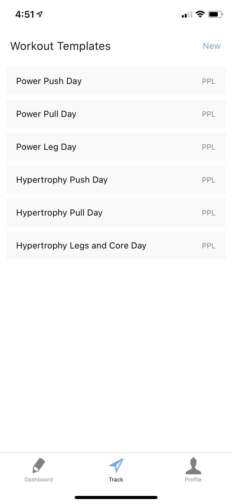
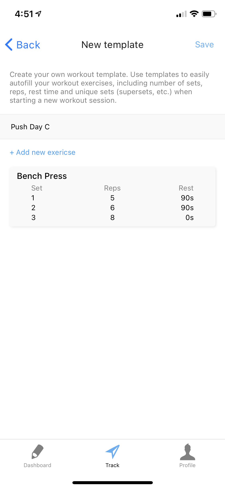
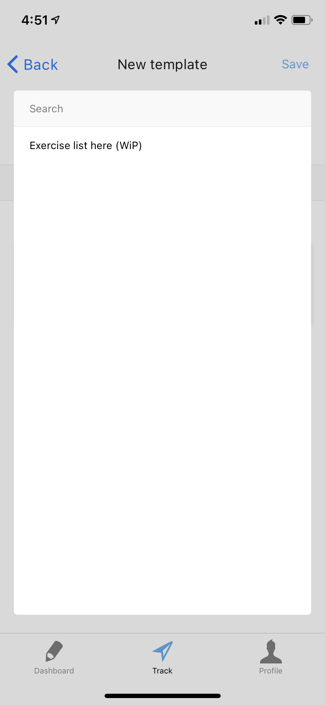

# Adept - a lightweight, reliable and flexible fitness progression app.

<em>This project is still in early development. To summarize, MVP is not available yet but most front-end and user interface components are ready. Attached below are some screenshots of the app, but nothing is final.</em>

Most of the fitness tracking apps on both the iOS and Android platforms less a tool but more a chore. They have one common issue: flexibility. While they aim to ease users by providing a sort of database for available exercises, this can be counter-intuitive as users are forced to only select the exercises and format provided by the database itself. Moreover, most apps does not account variability such that a person might change a workout dynamically throughout its cycle. These advanced techniques require flexibility in storing the workout data, and this is what this application aim to tackle. With Adept, we will ensure gym-goers all the tool they need to track their workouts effectively without gimmicks.

This project is written on TypeScript using React Native, Firebase and TypeORM (SQLite) frameworks. 

